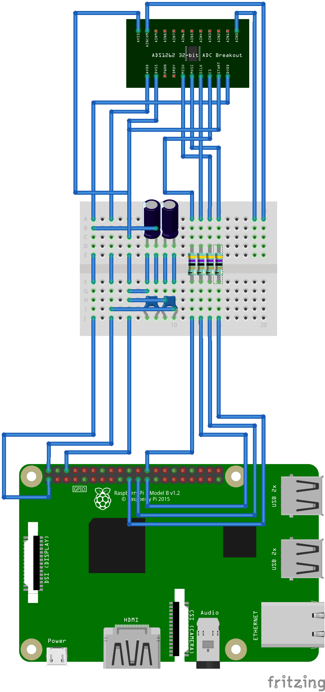

# Pascal library for ADS1262 on Raspberry Pi 3B

### Description
This is a Pascal library for FPC/LAZARUS/CODETYPHON for the Raspberry Pi running on Raspian.
It was developed under Codetyphon 6.7, fpc 3.3.1, Raspberry Pi 3B and Raspian Stretch.
The main file is ads1262_unit.pas, which contains all code for the programming of the SPI-Bus and the ADS1262.
The configuration uses AIN0 and AINCOM for the input signals. Please note that this configuration expects that the input signals are differential inputs which are not coupled to a potential of the ADC, e.g. a coil.
The AINCOM input is coupled by VBIAS mode to a level shift voltage : VBIAS = (AVDD + AVSS) / 2. 
This source code was developed for a seismometer project. 
More information at http://www.seismometer.info.

### Connection
The following connection is used between ADS1262 and the Raspberry Pi:

 

### Hardware
The ADS1262 breakout board is produced by Protocentral: https://www.protocentral.com/analog-adc-boards/1005-protocentral-ads1262-32-bit-precision-adc-breakout-board-0642078949630.html. 

### Source Code
The source code was developed with codetyphon on the Raspberry Pi 3B, but should also work with Lazarus.

### Compiling
The file go.sh can be used for compiling, please check the path inside go.sh and adept it to your own source path.

### License
GNU LESSER GENERAL PUBLIC LICENSE Version 3, 29 June 2007

### Contact
Author  : Dr. Jürgen Abel 
Website : https://www.juergen-abel.info/ 
